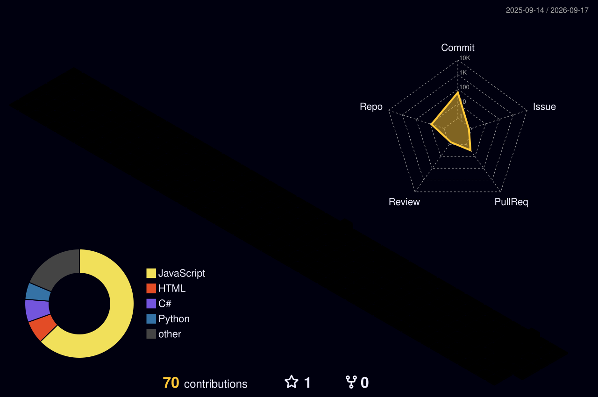

  <h1>Arthur Guidolin</h1>

  

    <b>Software Engineering @ PUCPR | Full-Stack Web Developer</b>
  

  

    
  

  

    
    
  

 

## 👨‍💻 About Me

I am a Software Engineering student based in **Curitiba, Brazil**, highly focused on building robust and modern web applications. I am continuously learning and evolving my stack to engineer better digital experiences.

- 🎓 **Education:** Software Engineering @ PUCPR *(Pontifícia Universidade Católica do Paraná)*
- 🎯 **Focus:** Web Development, Full-stack & Personal Projects
- 🌱 **Currently Learning:** JavaScript, React, C# & Web Frameworks
- 💡 **Mindset:** Always curious. Always building.

---

## 💻 Tech Stack & Tools

### Languages & Frameworks

- **Frontend:** HTML5, CSS3, JavaScript, React *(Learning)*
- **Backend:** Python, Java, Node.js, C# *(Learning)*

### Workspace & Version Control

- **Environment:** Linux Mint, VS Code, Git, GitHub
- **AI / Productivity:** Claude

---

## 📊 GitHub Analytics

  
  
  
    

  

---

## 🌌 Contribution Activity

  
<i>My daily commit activity, fully automated via GitHub Actions workflows.</i>

   

  <picture>
    <source media="(prefers-color-scheme: dark)" srcset="https://raw.githubusercontent.com/arthurguidolin/arthurguidolin/output/github-contribution-grid-snake-dark.svg" />
    <source media="(prefers-color-scheme: light)" srcset="https://raw.githubusercontent.com/arthurguidolin/arthurguidolin/output/github-contribution-grid-snake.svg" />
    
  </picture>

    

  

